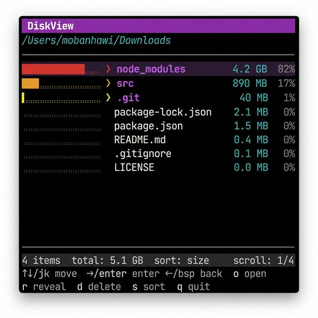

# aster

A terminal disk usage analyzer for macOS. Navigate your filesystem, identify large directories, and clean up — all from the terminal.

[](https://github.com/mobanhawi/aster/actions/workflows/go.yml)
[](https://github.com/mobanhawi/aster/actions/workflows/release.yml)
[](https://codecov.io/gh/mobanhawi/aster)



## Install

### Homebrew (recommended)

```bash
brew tap mobanhawi/aster
brew install aster
```

### Build from source

```bash
git clone https://github.com/mobanhawi/aster
cd aster
go build -o aster .
```

## Usage

```bash
./aster <path>
./aster ~/Downloads
./aster /
```

## Keys

| Key | Action |
|-----|--------|
| `j` / `k` or arrows | Move cursor |
| `enter` / `l` | Enter directory |
| `backspace` / `h` | Go back |
| `s` | Toggle sort (size / name) |
| `o` | Open in default app |
| `r` | Reveal in Finder |
| `d` | Move to Trash (with confirm) |
| `g` / `G` | Jump to top / bottom |
| `q` | Quit |

## Requirements

- macOS
- Go 1.21+
